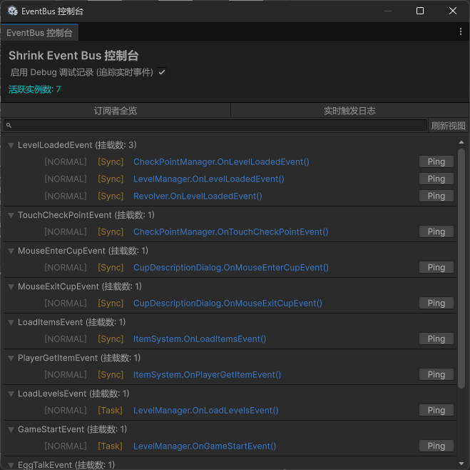
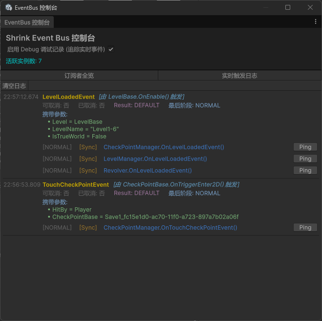

# ShrinkEventBus

一个为 Unity C# 项目设计的高性能、类型安全事件总线系统。支持优先级调度、编译期自动注册、同步/异步混合处理，以及完整的 MonoBehaviour 生命周期管理。

## ✨ 特性概览

| 特性 | 说明 |
|------|------|
| 🔒 **类型安全** | 基于泛型的强类型事件，编译期检查，无装箱开销 |
| ⚡ **高性能热路径** | 泛型静态缓存 `EventCache<T>` 绕过字典查找，触发路径几乎零开销 |
| 🤖 **零侵入自动注册** | 标记 `[EventBusSubscriber]` 即可，ILPostProcessor 编译期自动织入注册逻辑，动态创建的对象也无需手写任何代码 |
| 🎯 **双重优先级** | 支持枚举优先级与数字优先级组合，精确控制执行顺序 |
| 🔄 **同步 & 异步** | 统一支持 `Action`、`UniTask`、`Task` 三种 handler 形式 |
| 🧵 **线程安全** | 注册/注销操作全程加锁保护 |
| 📦 **对象池** | 内置 `EventPool<T>`，高频事件零 GC |
| 🔍 **调试友好** | Editor 事件查看器实时追踪订阅者与触发日志 |

## 📦 依赖

- Unity 2022.3+
- [UniTask](https://github.com/Cysharp/UniTask) `2.x`

## ⚙️ 安装

在项目的 `Packages/manifest.json` 中添加：

```json
{
  "dependencies": {
    "com.cysharp.unitask": "https://github.com/Cysharp/UniTask.git?path=src/UniTask/Assets/Plugins/UniTask",
    "com.cneicy.shrink-eventbus": "https://github.com/cneicy/ShrinkEventBus.git"
  }
}
```

或通过 Package Manager → `+` → `Add package from git URL` 输入：

```
https://github.com/cneicy/ShrinkEventBus.git
```

## 🚀 快速上手

### 第一步：定义事件

所有事件必须继承 `EventBase`，通过 Attribute 声明附加能力：

```csharp
// 普通事件
public class PlayerDiedEvent : EventBase
{
    public int PlayerId { get; set; }
    public string Cause { get; set; }
}

// 可取消事件
[Cancelable]
public class PlayerMoveEvent : EventBase
{
    public Vector3 OldPosition { get; set; }
    public Vector3 NewPosition { get; set; }
}

// 有返回结果的事件
[HasResult]
public class ItemPickupEvent : EventBase
{
    public string ItemId { get; set; }
    public GameObject Picker { get; set; }
}
```

### 第二步：订阅事件

在 MonoBehaviour 上标记 `[EventBusSubscriber]`，用 `[EventSubscribe]` 标记处理方法。

**无论是场景初始时存在的对象，还是运行时动态 `Instantiate` 的对象，都会在进入场景时自动完成注册，销毁时自动清理，无需手写任何注册代码。**

```csharp
[EventBusSubscriber]
public class UIManager : MonoBehaviour
{
    // 同步处理
    [EventSubscribe(EventPriority.NORMAL)]
    private void OnPlayerDied(PlayerDiedEvent evt)
    {
        ShowDeathScreen(evt.PlayerId);
    }

    // 异步处理（UniTask）
    [EventSubscribe(EventPriority.HIGH)]
    private async UniTask OnItemPickup(ItemPickupEvent evt)
    {
        await PlayPickupAnimation(evt.ItemId);
    }
}
```

### 第三步：触发事件

```csharp
// 同步触发
EventBus.TriggerEvent(new PlayerDiedEvent { PlayerId = 1, Cause = "Fall" });

// 异步触发（顺序等待每个 handler）
await EventBus.TriggerEventAsync(new PlayerMoveEvent
{
    OldPosition = transform.position,
    NewPosition = targetPos
});

// 使用对象池（高频场景推荐）
using var evt = EventPool<PlayerDiedEvent>.Get();
evt.PlayerId = 1;
EventBus.TriggerEvent(evt);
// using 块结束时自动归还到池中
```

## 🖼️ 追踪图形化

菜单栏 → `Window（窗口）` → `Shrink EventBus` → `事件查看器`





---

## 📖 核心概念

### 自动注册机制

ShrinkEventBus 通过 **ILPostProcessor** 在编译期自动处理注册逻辑。当 Unity 编译代码时，所有标记了 `[EventBusSubscriber]` 的 MonoBehaviour 子类会被自动识别，并在其 `Awake` 方法中织入 `EventBus.AutoRegister(this)`。

这意味着：

- 场景初始加载的对象 → `Awake` 执行时自动注册
- 运行时 `Instantiate` 的对象 → `Awake` 执行时自动注册
- GameObject 销毁时 → 自动反注册，无内存泄漏

**整个过程对业务代码完全透明，类里不需要写任何注册相关的代码。**

### 优先级系统

`EventPriority` 枚举定义了六个优先级档位，数值越小越先执行：

```
HIGHEST(0) → HIGH(1) → NORMAL(2) → LOW(3) → LOWEST(4) → MONITOR(5)
```

同一优先级档位内，可用数字优先级进一步细排（数字越大越先执行）：

```csharp
// 枚举优先级
[EventSubscribe(EventPriority.HIGH)]
private void Handler(SomeEvent evt) { }

// 数字优先级（自动映射到枚举档位）
EventBus.RegisterEvent<SomeEvent>(Handler, priority: 75); // 映射为 HIGH

// 手动注册时混合使用
EventBus.RegisterEvent<SomeEvent>(Handler, EventPriority.HIGH, receiveCanceled: false);
```

数字到枚举的映射规则：

| 数字范围 | 枚举档位 |
|---------|---------|
| ≥ 100 | HIGHEST |
| ≥ 50 | HIGH |
| > 0 | NORMAL |
| ≥ -50 | LOW |
| < -50 | LOWEST |

**推荐的优先级分工：**

```
HIGHEST  — 权限校验、合法性检查
HIGH     — 核心业务逻辑、数值计算
NORMAL   — 默认行为、状态变更
LOW      — UI 更新、音效、特效
LOWEST   — 收尾清理
MONITOR  — 日志、统计、监控（通常配合 receiveCanceled: true）
```

### 事件取消与结果

```csharp
// 取消事件（需标记 [Cancelable]）
[EventSubscribe(EventPriority.HIGHEST)]
private void ValidateMove(PlayerMoveEvent evt)
{
    if (!IsValidPosition(evt.NewPosition))
        evt.SetCanceled(true); // 后续未设置 receiveCanceled: true 的 handler 将跳过
}

// 监控处理器可以接收已取消的事件
[EventSubscribe(EventPriority.MONITOR, receiveCanceled: true)]
private void LogMove(PlayerMoveEvent evt)
{
    Debug.Log($"移动 {(evt.IsCanceled ? "被取消" : "成功")}");
}

// 触发方检查取消状态
var moveEvent = new PlayerMoveEvent { ... };
await EventBus.TriggerEventAsync(moveEvent);
if (!moveEvent.IsCanceled)
    transform.position = moveEvent.NewPosition;
```

```csharp
// 设置结果（需标记 [HasResult]）
[EventSubscribe(EventPriority.HIGH)]
private void CheckPermission(ItemPickupEvent evt)
{
    evt.SetResult(player.HasSpace ? EventResult.ALLOW : EventResult.DENY);
}

// 触发方读取结果
var pickupEvent = new ItemPickupEvent { ... };
EventBus.TriggerEvent(pickupEvent);
bool success = pickupEvent.Result switch
{
    EventResult.ALLOW   => true,
    EventResult.DENY    => false,
    EventResult.DEFAULT => DefaultPickupLogic()
};
```

### 注册方式对比

| 方式 | 适用场景 | 自动反注册 |
|------|---------|-----------|
| `[EventBusSubscriber]` + `[EventSubscribe]` | MonoBehaviour（推荐） | ✅ 随 GameObject 销毁 |
| `EventBus.RegisterEvent(...)` 手动注册 | 非 MonoBehaviour 类、Lambda | ❌ 需手动调用 `UnregisterEvent` |
| `EventBus.AutoRegister(this)` | 特殊场景下手动触发 | ✅ 需配合 `EventBusDestroyListener` |

**手动注册示例（非 MonoBehaviour）：**

```csharp
public class InventorySystem : IDisposable
{
    public InventorySystem()
    {
        EventBus.RegisterEvent<ItemPickupEvent>(OnItemPickup, EventPriority.NORMAL);
    }

    private void OnItemPickup(ItemPickupEvent evt) { /* ... */ }

    public void Dispose()
    {
        // 必须手动清理，否则 handler 持有 this 引用会造成内存泄漏
        EventBus.UnregisterAllEventsForObject(this);
    }
}
```

---

## 🔧 API 参考

### EventBus（静态门面）

#### 注册 / 注销

```csharp
// 同步 handler
EventBus.RegisterEvent<TEvent>(Action<TEvent> handler, EventPriority priority, bool receiveCanceled);
EventBus.RegisterEvent<TEvent>(Action<TEvent> handler, int priority);

// 异步 handler（UniTask）
EventBus.RegisterEvent<TEvent>(Func<TEvent, UniTask> handler, EventPriority priority, bool receiveCanceled);

// 注销
EventBus.UnregisterEvent<TEvent>(Action<TEvent> handler);
EventBus.UnregisterEvent<TEvent>(Func<TEvent, UniTask> handler);
EventBus.UnregisterAllEventsForObject(object target);  // 注销某实例的全部 handler
EventBus.ClearAllSubscribersForEvent<TEvent>();         // 清空某事件的全部订阅者
EventBus.UnregisterAllEvents();                         // 全部清空（谨慎使用）
```

#### 触发

```csharp
// 同步触发：async handler 会以 .Forget() 方式触发，不等待
bool handled = EventBus.TriggerEvent<TEvent>(TEvent eventArgs);

// 异步触发：顺序 await 每个 handler
bool handled = await EventBus.TriggerEventAsync<TEvent>(TEvent eventArgs);
```

> ⚠️ `TriggerEvent` 中遇到 async handler 时会调用 `.Forget()`，不会等待其完成。如果需要顺序等待，请使用 `TriggerEventAsync`。

#### 查询

```csharp
EventBus.IsInstanceRegistered(object target);
EventBus.GetRegisteredInstanceCount();
EventBus.GetRegisteredEventTypeCount();
EventBus.GetEventSubscribers<TEvent>();   // 返回 EventHandlerInfo[]
EventBus.GetListenerList<TEvent>();
```

### EventPool\<T\>

```csharp
// 从池中取出（自动重置状态）
var evt = EventPool<MyEvent>.Get();

// 手动归还
EventPool<MyEvent>.Release(evt);

// 推荐：配合 using 自动归还
using var evt = EventPool<MyEvent>.Get();
EventBus.TriggerEvent(evt);
// 作用域结束时调用 Dispose() → 自动归还
```

> ⚠️ 归还后不要再访问 `evt` 的属性，对象已被重置并放回池中。

### EventBase 关键成员

```csharp
evt.EventId          // Guid，每次触发唯一
evt.EventTime        // 事件创建时间（UTC）
evt.IsCancelable     // 是否支持取消（由 [Cancelable] 决定）
evt.HasResult        // 是否支持结果（由 [HasResult] 决定）
evt.IsCanceled       // 是否已被取消
evt.Result           // 当前结果（EventResult 枚举）
evt.Phase            // 当前执行到的优先级阶段
evt.CurrentHandler   // 当前正在执行的 handler 信息
evt.GetSubscribers() // 获取 handler 列表快照（调试用）
```

---

## 🏗️ 架构说明

```
ShrinkEventBus
├── Runtime/
│   ├── EventBus                 静态门面，所有公开 API 的入口
│   ├── EventCache<T>            泛型静态缓存，热路径绕过字典查找
│   ├── ListenerList             线程安全的有序 handler 列表
│   ├── EventHandlerInfo         单个 handler 的元信息（优先级、方法反射、调试信息）
│   ├── EventBase                所有事件的基类，携带生命周期状态
│   ├── EventPool<T>             对象池，高频事件减少 GC
│   ├── EventBusRegHelper        反射扫描 & handler 注册逻辑
│   ├── EventAutoRegHelper       场景加载时扫描并注册已存在的 MonoBehaviour
│   └── EventBusDestroyListener  挂在 GameObject 上，OnDestroy 时自动反注册
│
├── Editor/
│   └── EventBusViewerWindow     事件查看器，实时显示订阅者与触发日志
│
└── CodeGen/
    └── EventBusILPostProcessor  编译期织入，自动向 [EventBusSubscriber] 类注入注册逻辑
```

**热路径（`TriggerEvent`）工作流：**

```
TriggerEvent(evt)
  └─ 读取 EventCache<T>.List          // 静态字段，O(1)，无字典查找
       └─ GetHandlers()               // 返回内部数组引用，无拷贝
            └─ 遍历 handlers[]
                 ├─ 跳过已取消 & 不接收取消的 handler
                 ├─ Action<T> → 直接调用
                 └─ Func<T, UniTask> → .Forget()（同步路径）
```

**自动注册完整流程：**

```
【编译期】ILPostProcessor 扫描所有程序集
  └─ 找到标记了 [EventBusSubscriber] 的 MonoBehaviour 子类
       └─ 在其 Awake 方法头部织入 EventBus.AutoRegister(this)

【运行时 - 场景加载】RuntimeInitializeOnLoadMethod(AfterSceneLoad)
  └─ FindObjectsByType 扫描场景内已存在的对象补充兜底注册

【运行时 - 动态创建】Instantiate(prefab)
  └─ Unity 调用新对象的 Awake（已含织入代码）→ 自动注册

【运行时 - 销毁】GameObject.Destroy
  └─ EventBusDestroyListener.OnDestroy → UnregisterInstance → 自动反注册
```

---

## ✅ 最佳实践

**事件设计：尽量让属性只读**

```csharp
// ✅ 推荐：构造时传入，防止 handler 间意外修改输入数据
public class OrderPlacedEvent : EventBase
{
    public string OrderId { get; }
    public decimal Amount { get; }
    public OrderPlacedEvent(string orderId, decimal amount)
    {
        OrderId = orderId;
        Amount = amount;
    }
}

// ❌ 避免：公开可写属性，handler 间耦合风险高
public class BadEvent : EventBase
{
    public object Payload { get; set; }
}
```

**高频事件一定要用对象池**

```csharp
// ✅ 每帧触发的伤害/移动事件
using var dmgEvt = EventPool<DamageEvent>.Get();
dmgEvt.Value = damage;
EventBus.TriggerEvent(dmgEvt);

// ❌ 每帧 new，会产生大量 GC
EventBus.TriggerEvent(new DamageEvent { Value = damage });
```

**非 MonoBehaviour 类一定要手动清理**

```csharp
public void Dispose()
{
    EventBus.UnregisterAllEventsForObject(this);
}
```

**异步 handler 中谨慎触发新事件**

在 `TriggerEventAsync` 的 handler 内部再次 `await TriggerEventAsync`，链条过深时调用栈难以追踪，建议把二次触发拆到外部或改用消息队列。

---

## ⚠️ 注意事项

- **`TriggerEvent` 不等待异步 handler**：同步路径中的 UniTask handler 以 `.Forget()` 触发，执行结果和异常不会传回调用方。需要等待时请使用 `TriggerEventAsync`。
- **EventPool 归还后不要再使用**：`Release` 后对象会立即 `ResetInternal()`，继续访问属性将得到默认值。
- **不要在 handler 内直接注册/注销 handler**：可能影响当前正在遍历的 handler 数组，会产生语义上的不确定性。
- **静态 handler 永远不会自动注销**：静态方法注册后持续存活直到显式调用 `UnregisterEvent`，不要在静态 handler 里持有场景对象引用。
- **`[EventBusSubscriber]` 仅对 MonoBehaviour 生效自动注册**：非 MonoBehaviour 类标记该 Attribute 无任何效果，请使用手动注册。
- **ILPostProcessor 织入发生在编译期**：修改代码后需要重新编译才能使注入生效，热重载场景下请注意这一点。

---

## 🐛 常见问题排查

**事件没有被任何 handler 接收**

1. 检查订阅类是否有 `[EventBusSubscriber]`
2. 检查方法是否有 `[EventSubscribe]`，且签名为 `void/UniTask/Task Method(TEvent evt)`
3. 确认代码在标记 `[EventBusSubscriber]` 后重新编译过（ILPostProcessor 需要编译期运行）
4. 确认没有在 `Awake` 之前就触发事件（场景加载的兜底扫描在 `AfterSceneLoad` 完成）

```csharp
// 调试：主动检查注册状态
Debug.Log(EventBus.IsInstanceRegistered(this));
Debug.Log($"订阅者数量: {EventBus.GetEventSubscribers<MyEvent>().Length}");
```

**怀疑内存泄漏**

```csharp
// 检查是否有 handler 持有意外引用
var handlers = EventBus.GetEventSubscribers<MyEvent>();
foreach (var h in handlers)
    Debug.Log($"{h.DisplayDeclaringType.Name}.{h.DisplayMethodName} | target: {h.Target}");
```

**Editor 下想追踪事件流**

打开事件查看器：菜单栏 → `Window` → `Shrink EventBus` → `事件查看器`

也可以通过代码追踪：

```csharp
EventBus.EnableDebugRecord = true;
EventBus.TriggerEvent(evt);
foreach (var h in evt.GetSubscribers())
    Debug.Log($"[{h.Priority}] {h.DisplayDeclaringType.Name}.{h.DisplayMethodName}");
```

---

## 📄 License

[MIT](LICENSE)