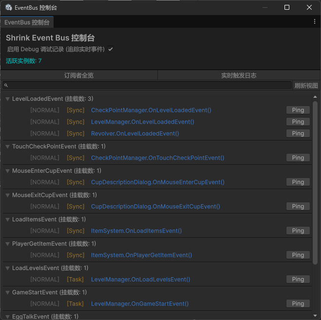
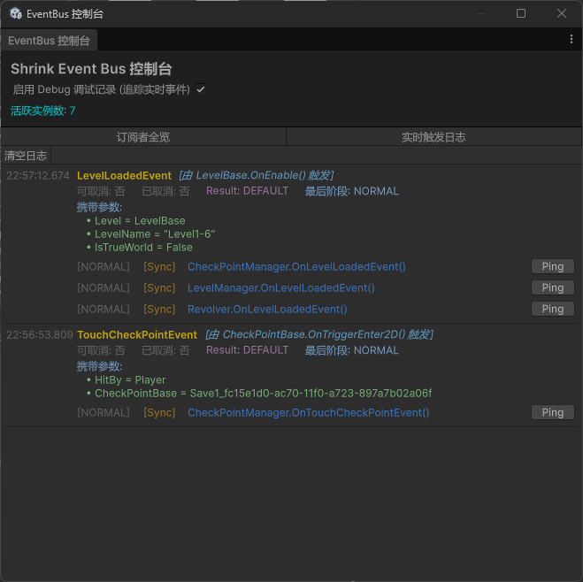

# ShrinkEventBus

一个为 Unity C# 项目设计的高性能、类型安全事件总线系统。支持优先级调度、编译期自动注册、同步/异步混合处理，以及完整的 MonoBehaviour 生命周期管理。

## ✨ 特性概览

| 特性 | 说明 |
|------|------|
| 🔒 **类型安全** | 基于泛型的强类型事件，编译期检查，无装箱开销 |
| ⚡ **高性能热路径** | 注册期预编译 invoker（无反射调用、无装箱），派发走缓存快照数组，监听者快照零拷贝挂接 |
| 🤖 **零侵入自动注册** | 标记 `[EventBusSubscriber]` 即可，ILPostProcessor 编译期自动织入注册与反注册逻辑，动态创建的对象也无需手写任何代码 |
| 🧾 **静态订阅清单** | 静态 `[EventBusSubscriber]` 现可通过编译期注册表收口，避免默认总线启动时全域扫描所有类型 |
| 🎯 **双重优先级** | 支持枚举优先级与数字优先级组合，精确控制执行顺序 |
| 🔄 **同步 & 异步** | 统一支持 `Action`（同步）与 `UniTask`（异步）两种 handler 形式 |
| 🧵 **线程安全** | 注册/注销操作全程加锁保护 |
| 📦 **对象池** | 内置 `EventPool<T>`，高频事件零 GC |
| 🔍 **调试友好** | Editor 事件查看器实时追踪订阅者与触发日志 |
| 🧩 **可实例化总线** | 除默认静态 `EventBus` 外，也可以用 Builder 创建独立 bus，并按需要配置异常策略、事件类型约束、分 phase 分发 |
| 🌳 **父事件监听** | 监听父事件类型时，子事件触发也会命中父事件监听器，便于做 Pre/Post 家族事件和统一监控 |

## 👓 Benchmark

[Benchmark结果](Benchmark.txt)

运行时仓库里自带 `EventBusBenchmark` 组件，当前会分别覆盖这些场景：

- 无订阅者 / 单订阅者 / 多订阅者同步触发
- 父事件监听子事件
- 按 `EventPriority` 分 phase 分发
- 单订阅者异步触发
- 手工 delegate 注册 / 注销
- `object / Type / MethodInfo` 扫描注册 / 注销
- `EventPool<T>` 与 `new`
- 已取消事件跳过

如果你在评估这次 `IShrinkEventBus`、继承监听和严格注册带来的成本变化，优先看这个组件的输出，而不是只看 `Benchmark.txt` 里的旧样本。

## 📦 依赖

- Unity 2022.3+
- [UniTask](https://github.com/Cysharp/UniTask) `2.x`

## ⚙️ 安装

在项目的 `Packages/manifest.json` 中添加：

```json
{
  "dependencies": {
    "com.cysharp.unitask": "https://github.com/Cysharp/UniTask.git?path=src/UniTask/Assets/Plugins/UniTask",
    "com.cneicy.shrink-eventbus": "https://github.com/cneicy/ShrinkEventBus.git"
  }
}
```

或通过 Package Manager → `+` → `Add package from git URL` 输入：

```
https://github.com/cneicy/ShrinkEventBus.git
```

> ⚠️ **自动织入依赖说明**：当前工作区同时支持两层织入。若当前程序集命中共享管线 `ShrinkShared.CodeGen` 的覆盖范围（例如同时引用 `ShrinkCommand.Runtime` / `ShrinkNetwork.Runtime` / `ShrinkApp.Core.Runtime`），则优先由共享管线处理；其余只引用 `ShrinkEventBus.Runtime` 的程序集由模块内 `CodeGen/` 本地 ILPostProcessor 兜底。独立安装本包但未带上 `CodeGen/` 或共享管线时，没有编译期织入，请改用手动接入：MonoBehaviour 在 `Awake`/`OnDestroy` 中调用 `EventBus.AutoRegister(this)` / `EventBus.UnregisterInstance(this)`，或使用 `SubscribeEvent` 句柄。

## 🚀 快速上手

### 第一步：定义事件

所有事件必须继承 `EventBase`，通过 Attribute 声明附加能力：

```csharp
// 普通事件
public class PlayerDiedEvent : EventBase
{
    public int PlayerId { get; set; }
    public string Cause { get; set; }
}

// 可取消事件
[Cancelable]
public class PlayerMoveEvent : EventBase
{
    public Vector3 OldPosition { get; set; }
    public Vector3 NewPosition { get; set; }
}

// 有返回结果的事件
[HasResult]
public class ItemPickupEvent : EventBase
{
    public string ItemId { get; set; }
    public GameObject Picker { get; set; }
}
```

### 第二步：订阅事件

在 MonoBehaviour 上标记 `[EventBusSubscriber]`，用 `[EventSubscribe]` 标记处理方法。

**无论是场景初始时存在的对象，还是运行时动态 `Instantiate` 的对象，都会在 `Awake` 时自动完成注册，销毁时自动清理，无需手写任何注册代码。**

```csharp
[EventBusSubscriber]
public class UIManager : MonoBehaviour
{
    // 同步处理
    [EventSubscribe(EventPriority.NORMAL)]
    private void OnPlayerDied(PlayerDiedEvent evt)
    {
        ShowDeathScreen(evt.PlayerId);
    }

    // 异步处理（UniTask）
    [EventSubscribe(EventPriority.HIGH)]
    private async UniTask OnItemPickup(ItemPickupEvent evt)
    {
        await PlayPickupAnimation(evt.ItemId);
    }
}
```

### 第三步：触发事件

```csharp
// 同步触发
EventBus.TriggerEvent(new PlayerDiedEvent { PlayerId = 1, Cause = "Fall" });

// 异步触发（顺序等待每个 handler）
await EventBus.TriggerEventAsync(new PlayerMoveEvent
{
    OldPosition = transform.position,
    NewPosition = targetPos
});

// 使用对象池（高频场景推荐）
using var evt = EventPool<PlayerDiedEvent>.Get();
evt.PlayerId = 1;
EventBus.TriggerEvent(evt);
// using 块结束时自动归还到池中
```

## 🖼️ 追踪图形化

菜单栏 → `ShrinkSDK` → `事件总线` → `事件查看器`





实时触发日志页现已支持关键词过滤、按“有监听者 / 无监听者”筛选，以及“折叠同类事件”聚合查看，适合排查高频事件刷屏场景。

---

## 📖 核心概念

### 自动注册机制

ShrinkEventBus 通过 **ILPostProcessor** 在编译期自动处理完整的生命周期管理。当 Unity 编译代码时，所有标记了 `[EventBusSubscriber]` 且自身或基类链上存在实例 `[EventSubscribe]` 方法的 MonoBehaviour 子类会被自动识别，并在其 `Awake` 和 `OnDestroy` 方法中分别织入注册与反注册逻辑（没有任何实例订阅方法的类型会被跳过，不织入也不报错）。

当前织入策略如下：

- 命中共享管线 `ShrinkShared.CodeGen` 覆盖范围的程序集，优先由共享管线处理。
- 其余只引用 `ShrinkEventBus.Runtime` 的程序集，由模块内 `CodeGen/Editor/EventBusILPostProcessor.cs` 本地处理。
- 因此 ShrinkSDK 工作区内的统一 CodeGen 与独立 `ShrinkEventBus` 业务程序集可以同时兼容，且不会双重织入。

织入规则如下：

- 类**自身已有** `Awake`/`OnDestroy`：在方法头部插入，用户自己负责 `base` 调用
- 类**没有**，但**基类有虚方法**：生成 `protected override` 并自动调用 `base` 方法，`Awake` 顺序为 `base.Awake() → AutoRegister`，`OnDestroy` 顺序为 `UnregisterInstance → base.OnDestroy()`
- 类**没有**，基类**也没有**：生成私有方法并插入

这意味着：

- 场景初始加载的对象 → `Awake` 执行时自动注册
- 运行时 `Instantiate` 的对象 → `Awake` 执行时自动注册
- GameObject 销毁时 → `OnDestroy` 执行时自动反注册，无内存泄漏

**整个过程对业务代码完全透明，类里不需要写任何注册相关的代码。**

### 实例化总线与 Builder

默认情况下，项目继续使用全局静态门面 `EventBus`。如果你需要更清晰的模块边界，也可以创建独立 bus：

```csharp
var gameplayBus = EventBus.CreateBus(builder => builder
    .AllowPerPhaseDispatch()
    .SetExceptionHandlingMode(ShrinkEventExceptionHandlingMode.LogAndThrow));

gameplayBus.Register(new GameplaySubscribers());
gameplayBus.TriggerEvent(new PlayerDiedEvent { PlayerId = 1, Cause = "Fall" });
```

当前 Builder 支持的重点配置：

- `SetExceptionHandlingMode(...)`
- `SetExceptionHandler(...)`
- `AllowPerPhaseDispatch()`
- `CheckTypesOnDispatch()`
- `MarkerInterface<TMarker>()`
- `ClassChecker(...)`
- `StartShutdown()`

如果你只是想继续沿用旧习惯，直接用静态 `EventBus` 即可；它内部就是一个默认的 `IShrinkEventBus` 实例。

### 手动注册的新边界

除了 `AutoRegister(this)` / `[EventBusSubscriber]` 这条 Unity 友好的自动接入路径，现在也支持更显式的手动注册：

```csharp
// 扫描实例上的 [EventSubscribe] 方法
EventBus.Register(mySubscriberInstance);

// 扫描某个类型上的 static [EventSubscribe] 方法
EventBus.Register(typeof(GlobalEventHooks));

// 只注册某一个 static [EventSubscribe] 方法
EventBus.Register(typeof(GlobalEventHooks).GetMethod("OnPlayerDied",
    BindingFlags.Static | BindingFlags.NonPublic));
```

和旧版本相比，手动注册现在会更严格：

- 方法必须带 `[EventSubscribe]`
- 只能有一个参数
- 参数必须继承 `EventBase`
- 返回值只能是 `void` 或 `UniTask`
- 实例注册只接受实例方法，类型/方法注册只接受静态方法

这样做的目的是把“为什么没触发”尽量提前到注册阶段暴露，而不是静默吞掉。

### 优先级系统

`EventPriority` 枚举定义了六个优先级档位，数值越小越先执行：

```
HIGHEST(0) → HIGH(1) → NORMAL(2) → LOW(3) → LOWEST(4) → MONITOR(5)
```

同一优先级档位内，可用数字优先级进一步细排（数字越大越先执行）：

```csharp
// 枚举优先级
[EventSubscribe(EventPriority.HIGH)]
private void Handler(SomeEvent evt) { }

// 数字优先级（自动映射到枚举档位；手动注册时必须显式传入数字）
EventBus.RegisterEvent<SomeEvent>(Handler, priority: 75); // 映射为 HIGH

// 手动注册时混合使用
EventBus.RegisterEvent<SomeEvent>(Handler, EventPriority.HIGH, receiveCanceled: false);
```

数字到枚举的映射规则：

| 数字范围 | 枚举档位 |
|---------|---------|
| ≥ 100 | HIGHEST |
| ≥ 50 | HIGH |
| ≥ 0 | NORMAL |
| ≥ -50 | LOW |
| < -50 | LOWEST |

> 1.3.0 起：数字 `0` 映射到 `NORMAL`（与枚举重载默认值一致）；int 重载不再提供默认值，不带优先级的 `RegisterEvent(handler)` 调用唯一解析到枚举重载（NORMAL）。

**推荐的优先级分工：**

```
HIGHEST  — 权限校验、合法性检查
HIGH     — 核心业务逻辑、数值计算
NORMAL   — 默认行为、状态变更
LOW      — UI 更新、音效、特效
LOWEST   — 收尾清理
MONITOR  — 日志、统计、监控（通常配合 receiveCanceled: true）
```

如果你创建的 bus 开启了 `AllowPerPhaseDispatch()`，也可以只分发某一个 phase：

```csharp
gameplayBus.TriggerEvent(EventPriority.HIGH, evt);
await gameplayBus.TriggerEventAsync(EventPriority.MONITOR, evt);
```

这个模式主要适合做框架级流水线控制；普通业务仍推荐直接走完整分发。

### 父事件监听

现在监听父事件时，子事件触发也会命中父事件监听器：

```csharp
public class DamageEvent : EventBase
{
    public int Value { get; set; }
}

public sealed class CriticalDamageEvent : DamageEvent
{
    public bool IsCritical { get; set; }
}

EventBus.RegisterEvent<DamageEvent>(OnAnyDamage, EventPriority.MONITOR, receiveCanceled: true);
EventBus.TriggerEvent(new CriticalDamageEvent { Value = 42, IsCritical = true });
```

这很适合做统一日志、统一权限检查、事件族级别的监控和桥接。

### 事件取消与结果

```csharp
// 取消事件（需标记 [Cancelable]）
[EventSubscribe(EventPriority.HIGHEST)]
private void ValidateMove(PlayerMoveEvent evt)
{
    if (!IsValidPosition(evt.NewPosition))
        evt.SetCanceled(true); // 后续未设置 receiveCanceled: true 的 handler 将跳过
}

// 监控处理器可以接收已取消的事件
[EventSubscribe(EventPriority.MONITOR, receiveCanceled: true)]
private void LogMove(PlayerMoveEvent evt)
{
    Debug.Log($"移动 {(evt.IsCanceled ? "被取消" : "成功")}");
}

// 触发方检查取消状态
var moveEvent = new PlayerMoveEvent { ... };
await EventBus.TriggerEventAsync(moveEvent);
if (!moveEvent.IsCanceled)
    transform.position = moveEvent.NewPosition;
```

```csharp
// 设置结果（需标记 [HasResult]）
[EventSubscribe(EventPriority.HIGH)]
private void CheckPermission(ItemPickupEvent evt)
{
    evt.SetResult(player.HasSpace ? EventResult.ALLOW : EventResult.DENY);
}

// 触发方读取结果
var pickupEvent = new ItemPickupEvent { ... };
EventBus.TriggerEvent(pickupEvent);
bool success = pickupEvent.Result switch
{
    EventResult.ALLOW   => true,
    EventResult.DENY    => false,
    EventResult.DEFAULT => DefaultPickupLogic()
};
```

### 注册方式对比

| 方式 | 适用场景 | 自动反注册 |
|------|---------|-----------|
| `[EventBusSubscriber]` + `[EventSubscribe]` | MonoBehaviour（推荐） | ✅ ILP 织入 OnDestroy，随 GameObject 销毁自动清理 |
| `EventBus.SubscribeEvent(...)` 手动订阅 | 非 MonoBehaviour 类、Lambda | ✅ `Dispose()` 即可精准清理 |
| `EventBus.RegisterEvent(...)` 手动注册 | 兼容旧代码 | ❌ 需手动调用 `UnregisterEvent` |
| `EventBus.AutoRegister(this)` | 特殊场景下手动触发 | ❌ 需手动调用 `UnregisterInstance` |

**手动注册示例（非 MonoBehaviour）：**

```csharp
public class InventorySystem : IDisposable
{
    private readonly IShrinkEventSubscription _itemPickupSubscription;

    public InventorySystem()
    {
        _itemPickupSubscription = EventBus.SubscribeEvent<ItemPickupEvent>(OnItemPickup, EventPriority.NORMAL);
    }

    private void OnItemPickup(ItemPickupEvent evt) { /* ... */ }

    public void Dispose()
    {
        _itemPickupSubscription.Dispose();
    }
}
```

---

## 🔧 API 参考

### EventBus（静态门面）

#### 注册 / 注销

```csharp
// 同步 handler
EventBus.RegisterEvent<TEvent>(Action<TEvent> handler, EventPriority priority, bool receiveCanceled);
EventBus.RegisterEvent<TEvent>(Action<TEvent> handler, int priority);
EventBus.SubscribeEvent<TEvent>(Action<TEvent> handler, EventPriority priority, bool receiveCanceled);
EventBus.SubscribeEvent<TEvent>(Action<TEvent> handler, int priority);

// 异步 handler（UniTask）
EventBus.RegisterEvent<TEvent>(Func<TEvent, UniTask> handler, EventPriority priority, bool receiveCanceled);
EventBus.SubscribeEvent<TEvent>(Func<TEvent, UniTask> handler, EventPriority priority, bool receiveCanceled);

// 注销
EventBus.UnregisterEvent<TEvent>(Action<TEvent> handler);
EventBus.UnregisterEvent<TEvent>(Func<TEvent, UniTask> handler);
EventBus.UnregisterAllEventsForObject(object target);  // 注销某实例的全部 handler
EventBus.ClearAllSubscribersForEvent<TEvent>();         // 清空某事件的全部订阅者
EventBus.UnregisterAllEvents();                         // 全部清空（谨慎使用）
```

#### 触发

```csharp
// 同步触发：只同步等待 sync handler；async handler 会基于事件快照 fire-and-forget
bool handled = EventBus.TriggerEvent<TEvent>(TEvent eventArgs);

// 异步触发：顺序 await 每个 handler
bool handled = await EventBus.TriggerEventAsync<TEvent>(TEvent eventArgs);
```

> ⚠️ `TriggerEvent` 中遇到 async handler 时，不会等待其完成，而是对当前事件做一份快照后异步执行。如果你需要让 async handler 参与最终状态（如 `IsCanceled` / `Result` / 后续字段改写），请使用 `TriggerEventAsync`。

#### 查询

```csharp
EventBus.IsInstanceRegistered(object target);
EventBus.GetRegisteredInstanceCount();
EventBus.GetRegisteredEventTypeCount();
EventBus.GetEventSubscribers<TEvent>();   // 返回 EventHandlerInfo[]
EventBus.GetListenerList<TEvent>();       // 无订阅者时返回 null
EventBus.GetActiveSubscriptionsSnapshot();// 返回 IDisposable 订阅快照
```

### EventPool\<T\>

```csharp
// 从池中取出（自动重置状态）
var evt = EventPool<MyEvent>.Get();

// 手动归还
EventPool<MyEvent>.Release(evt);

// 推荐：配合 using 自动归还
using var evt = EventPool<MyEvent>.Get();
EventBus.TriggerEvent(evt);
// 作用域结束时调用 Dispose() → 自动归还
```

> ⚠️ 归还后不要再访问 `evt` 的属性，对象已被重置并放回池中。

### EventBase 关键成员

```csharp
evt.EventId          // Guid，每次派发唯一（懒生成，首次访问时分配）
evt.EventTime        // 事件创建时间（UTC）
evt.IsCancelable     // 是否支持取消（由 [Cancelable] 决定）
evt.HasResult        // 是否支持结果（由 [HasResult] 决定）
evt.IsCanceled       // 是否已被取消
evt.Result           // 当前结果（EventResult 枚举）
evt.Phase            // 当前执行到的优先级阶段
evt.CurrentHandler   // 当前正在执行的 handler 信息
evt.GetSubscribers() // 获取本次派发的 handler 快照拷贝（调试用）
```

---

## 🏗️ 架构说明

```
ShrinkEventBus
├── Runtime/
│   ├── EventBus                 静态门面，内部是一个默认 IShrinkEventBus 实例
│   ├── ShrinkEventBusInstance   总线实现：注册、派发、异常策略、phase 分发
│   ├── ShrinkEventBusBuilder    实例总线的构建与配置入口
│   ├── ListenerList             按 phase 分桶的有序 handler 列表，带快照缓存与父链合并
│   ├── EventHandlerInfo         单个 handler 的元信息（优先级、预编译 invoker、调试信息）
│   ├── EventBase                所有事件的基类，携带生命周期状态与派发快照
│   ├── EventPool<T>             对象池，高频事件减少 GC
│   ├── EventCloneUtility        同步路径上 async handler 的事件快照克隆
│   ├── EventBusRegHelper        反射扫描 & handler 注册逻辑
│   └── EventAutoRegHelper       运行时初始化，确保 IsInitialized 状态正确
│
├── Editor/
│   └── EventBusViewerWindow     事件查看器，实时显示订阅者与触发日志
│
└── （织入）ShrinkShared.CodeGen / CodeGen  共享 ILPostProcessor 优先，本地 ILPostProcessor 兜底
                                          向 [EventBusSubscriber] 类注入 Awake（AutoRegister）
                                          与 OnDestroy（UnregisterInstance）
```

**热路径（`TriggerEvent`）工作流：**

```
TriggerEvent(evt)
  └─ 取该事件类型的 ListenerList     // 总线级字典 + 共享锁，每类型常数开销
       └─ GetHandlers()              // 返回缓存快照数组（脏时才重建），无拷贝
            ├─ 快照数组引用挂到事件对象上（一次赋值，供 GetSubscribers 调试）
            └─ 遍历 handlers[]
                 ├─ 跳过已取消 & 不接收取消的 handler
                 ├─ Action<T> → 经预编译 invoker 直接调用
                 └─ Func<T, UniTask> → 克隆事件快照后 .Forget()（同步路径）
```

**自动注册完整流程：**

```
【编译期】若当前程序集命中 ShrinkShared.CodeGen 覆盖范围，则由共享 ILPostProcessor 扫描；
         否则由 CodeGen/EventBusILPostProcessor.cs 本地扫描
  └─ 找到标记了 [EventBusSubscriber] 且存在实例 [EventSubscribe] 方法的 MonoBehaviour 子类
       ├─ 在 Awake 头部织入 EventBus.AutoRegister(this)
       └─ 在 OnDestroy 头部织入 EventBus.UnregisterInstance(this)
            （类无对应方法时自动生成，有虚基类方法时自动调用 base）
  ※ 只引用 ShrinkEventBus.Runtime 的纯业务程序集目前不在织入范围内，需手动 AutoRegister

【运行时 - 默认静态总线启动】
  └─ 读取编译期静态订阅清单，注册 static [EventSubscribe] 方法

【运行时 - 动态创建】Instantiate(prefab)
  └─ Unity 调用新对象的 Awake（已含织入代码）→ 自动注册

【运行时 - 销毁】GameObject.Destroy
  └─ OnDestroy（已含织入代码）→ UnregisterInstance → 自动反注册
```

---

## ✅ 最佳实践

**事件设计：尽量让属性只读**

```csharp
// ✅ 推荐：构造时传入，防止 handler 间意外修改输入数据
public class OrderPlacedEvent : EventBase
{
    public string OrderId { get; }
    public decimal Amount { get; }
    public OrderPlacedEvent(string orderId, decimal amount)
    {
        OrderId = orderId;
        Amount = amount;
    }
}

// ❌ 避免：公开可写属性，handler 间耦合风险高
public class BadEvent : EventBase
{
    public object Payload { get; set; }
}
```

**高频事件一定要用对象池**

```csharp
// ✅ 每帧触发的伤害/移动事件
using var dmgEvt = EventPool<DamageEvent>.Get();
dmgEvt.Value = damage;
EventBus.TriggerEvent(dmgEvt);

// ❌ 每帧 new，会产生大量 GC
EventBus.TriggerEvent(new DamageEvent { Value = damage });
```

**非 MonoBehaviour 类一定要手动清理**

```csharp
public void Dispose()
{
    EventBus.UnregisterAllEventsForObject(this);
}
```

**异步 handler 中谨慎触发新事件**

在 `TriggerEventAsync` 的 handler 内部再次 `await TriggerEventAsync`，链条过深时调用栈难以追踪，建议把二次触发拆到外部或改用消息队列。

---

## ⚠️ 注意事项

- **`TriggerEvent` 不等待异步 handler**：同步路径中的 UniTask handler 会基于事件快照异步执行，执行结果和异常不会传回调用方，对原事件对象的改动也不会回写。需要等待并拿到最终状态时请使用 `TriggerEventAsync`。
- **同步路径中的 async 快照是浅拷贝**：事件对象本身会复制一份，但如果载荷里挂着可变引用类型（如 `List<>`、`Dictionary<>`、自定义引用对象），内部成员仍然是共享引用。高风险数据建议改成不可变载荷，或统一走 `TriggerEventAsync`。
- **EventPool 归还后不要再使用**：`Release` 后对象会立即 `ResetInternal()`，继续访问属性将得到默认值。
- **不要在 handler 内直接注册/注销 handler**：可能影响当前正在遍历的 handler 快照，会产生语义上的不确定性。
- **静态 handler 永远不会自动注销**：静态方法注册后持续存活直到显式调用 `UnregisterEvent`，不要在静态 handler 里持有场景对象引用。
- **`[EventBusSubscriber]` 仅对 MonoBehaviour 生效自动注册**：非 MonoBehaviour 类标记该 Attribute 无任何效果，请使用手动注册。
- **标了 `[EventBusSubscriber]` 但没有实例 `[EventSubscribe]` 方法的类**：编译期不会织入；若通过 `AutoRegister` 手动接入，会输出警告并跳过（不抛异常）。显式 `Register()` 对此仍严格抛错。
- **int 数字优先级重载必须显式传值**：1.3.0 起 int 重载不再有默认值；数字 `0` 映射 `NORMAL`。
- **ILPostProcessor 织入发生在编译期**：修改代码后需要重新编译才能使注入生效，热重载场景下请注意这一点。
- **继承泛型基类（如 `Singleton<T>`）时无需额外处理**：ILP 会正确识别泛型基类中的虚方法并生成 `protected override`，自动调用 `base.Awake()` 和 `base.OnDestroy()`。

---

## 🐛 常见问题排查

**事件没有被任何 handler 接收**

1. 检查订阅类是否有 `[EventBusSubscriber]`
2. 检查方法是否有 `[EventSubscribe]`，且签名为 `void/UniTask Method(TEvent evt)`
3. 确认代码在标记 `[EventBusSubscriber]` 后重新编译过（ILPostProcessor 需要编译期运行）
4. 确认没有在 `Awake` 之前就触发事件

```csharp
// 调试：主动检查注册状态
Debug.Log(EventBus.IsInstanceRegistered(this));
Debug.Log($"订阅者数量: {EventBus.GetEventSubscribers<MyEvent>().Length}");
```

**怀疑内存泄漏**

```csharp
// 检查是否有 handler 持有意外引用
var handlers = EventBus.GetEventSubscribers<MyEvent>();
foreach (var h in handlers)
    Debug.Log($"{h.DisplayDeclaringType.Name}.{h.DisplayMethodName} | target: {h.Target}");
```

**Editor 下想追踪事件流**

打开事件查看器：菜单栏 → `ShrinkSDK` → `事件总线` → `事件查看器`

也可以通过代码追踪：

```csharp
EventBus.EnableDebugRecord = true;
EventBus.TriggerEvent(evt);
foreach (var h in evt.GetSubscribers())
    Debug.Log($"[{h.Priority}] {h.DisplayDeclaringType.Name}.{h.DisplayMethodName}");
```

---

## 📄 License

[MIT](LICENSE)
